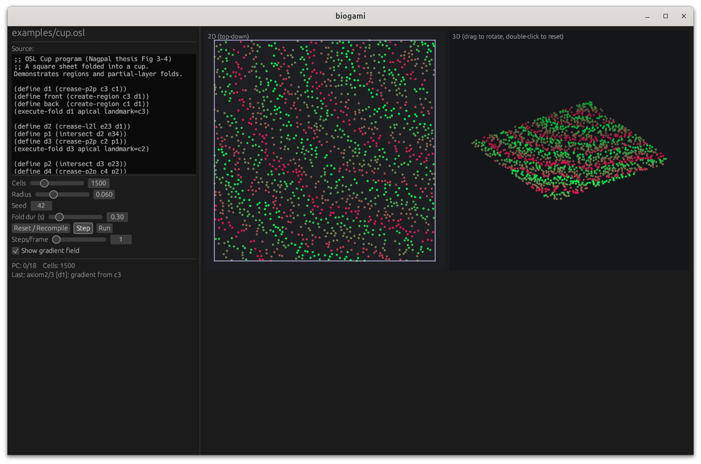

# biogami



A Rust implementation of Radhika Nagpal's MIT thesis,
*"Programmable Self-Assembly: Constructing Global Shape using
Biologically-inspired Local Interactions and Origami Mathematics"* (2001).

It contains:

- a Lisp-style parser and AST for the **Origami Shape Language (OSL)**,
- a **global geometric interpreter** that evaluates OSL programs analytically
  (Huzita's axioms 1–4 + flat folds by reflection),
- a **compiler** that lowers an OSL program to a **cell program** (a sequence
  of `axiomN-rule`, `intersect-rule`, `create-region-rule`, `execute-fold-rule`
  calls with allocated gradient names — matching Fig 4-8 of the thesis),
- a **cell-level simulator** with thousands of randomly distributed cells,
  local communication within a radius, BFS gradient propagation, axiom
  implementation by gradient comparison, region formation by bounded
  gradients, and physical folding,
- an **egui** visualiser of the cell sheet, gradients, creases, and folds.

## Toolchain

```
cargo build --release
```

### bgcompile — OSL → cell program

```
cargo run --bin bgcompile -- examples/cup.osl
cargo run --bin bgcompile -- examples/cup.osl -o cup.cell
```

### bgrun — interpret + simulate

```
# global geometric run (prints crease pattern + folded layers)
cargo run --bin bgrun -- examples/cup.osl

# cell-level simulation, text trace
cargo run --bin bgrun -- examples/cup.osl --cell-sim --cells 1500 --radius 0.06

# graphical visualiser (egui)
cargo run --bin bgrun -- examples/cup.osl --gui
```

## OSL primitives implemented

| Form                                       | Description                                  |
|--------------------------------------------|----------------------------------------------|
| `(crease-lbp p1 p2 [color])`               | Huzita A1: line through two points           |
| `(crease-p2p p1 p2 [color])`               | Huzita A2: perpendicular bisector            |
| `(crease-l2l l1 l2 [color])`               | Huzita A3: angle bisector                    |
| `(crease-l2s l1 p1 [color])`               | Huzita A4: through p1, perpendicular to l1   |
| `(intersect l1 l2)`                        | Intersection point                           |
| `(execute-fold line type landmark=p)`      | Fold with apical/basal type                  |
| `(create-region p1 l1)`                    | Half-plane region defined by line + side     |
| `(within-region r expr...)`                | Restrict ops to a region                     |
| `(define name expr)` / `(defun (n a..) b)` | Naming and procedures (procedures inlined)   |

## Examples

- `examples/cup.osl` — the canonical cup (Fig 3-4)
- `examples/airplane.osl` — paper airplane via a `fold-wing` procedure
- `examples/grid.osl` — a 4×4 grid pattern from `crease-l2l`

## References

- Nagpal, *Programmable Self-Assembly*, MIT PhD thesis, 2001.
